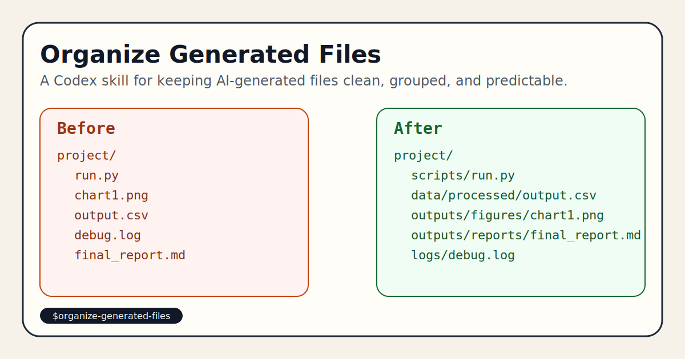

# Organize Generated Files



Keep AI-generated files organized by workflow, artifact role, and file type, instead of dumping everything into the project root.

[English](#english) | [中文](#中文)

## 中文

### 📖 为什么做这个项目

当你第三次调试同一个“帮我生成文件”的 prompt 时，另一个项目里的文件可能已经堆满根目录，脚本、日志、图表、临时 CSV 和最终报告混在一起，几天后连自己都找不到东西。

在真实工作流里，AI 已经能高效生成内容，但“生成之后放哪儿”这一步往往没有被认真设计。结果就是：

- 文件位置混乱
- 根目录被污染
- 中间产物和最终结果混在一起
- 同一任务的相关文件彼此分散

我们不想让 AI 继续把项目越写越乱。这个 skill 的目标很直接：让 AI 在生成文件之前，先想清楚目录结构，再把文件按工作流和产物角色放进正确的位置。

### 🎯 这个 skill 做了什么

它给 Codex/Agent 一套明确的落盘规则：

- 优先按工作流或任务逻辑分组，而不是只按扩展名乱放
- 区分源码、临时文件、中间产物和最终输出
- 在文件数量变多时自动建议创建文件夹
- 尽量复用仓库已有约定，避免“另起一套新规范”
- 保持项目根目录整洁，只有真正的顶层控制文件才放在根目录

### ✨ 特点

- 实战导向：面向真实 AI 生成场景，不是纸面上的“理想目录规范”
- 开箱即用：直接作为 skill 使用，不需要额外脚本
- 低侵入：优先适配已有项目结构，不强行推翻原有组织方式
- 可扩展：既适合论文项目，也适合数据分析、代码生成、内容生产等场景

### 🧠 它适合什么场景

- AI 一次性生成多个文件
- 生成脚本的同时还会生成日志、CSV、图表、报告
- 同一个任务有 raw / processed / outputs 多个阶段
- 你想避免大量文件直接散落在根目录
- 你希望 agent 在写文件前先规划放置位置

### 🚀 如何使用

直接在支持 skills 的环境里调用：

```text
Use $organize-generated-files to place new files into a clean, predictable folder structure.
```

也可以在更具体的任务里这样说：

```text
Use $organize-generated-files and create a scraper, its logs, sample data, and final report in a clean folder structure.
```

### 🗂 推荐目录思路

当仓库还没有清晰约定时，这个 skill 倾向于使用类似结构：

```text
src/
scripts/
data/raw/
data/processed/
outputs/
outputs/reports/
outputs/figures/
logs/
tmp/
drafts/
archive/
```

### 示例：整理前 vs 整理后

整理前：

```text
project/
  run.py
  chart1.png
  chart2.png
  final_report.md
  final_report_v2.md
  output.csv
  output_tmp.csv
  debug.log
  notes.txt
```

整理后：

```text
project/
  scripts/
    run.py
  data/
    processed/
      output.csv
      output_tmp.csv
  outputs/
    reports/
      final_report.md
      final_report_v2.md
    figures/
      chart1.png
      chart2.png
  logs/
    debug.log
  drafts/
    notes.txt
```

### 📦 仓库内容

- `SKILL.md`: skill 的核心规则与判断逻辑
- `agents/openai.yaml`: skill 的元信息
- `assets/preview.svg`: GitHub 展示用预览图
- `examples/usage-examples.md`: 更多使用示例

### 📝 建议的 GitHub 仓库描述文案

短描述（适合 GitHub About）：

```text
A Codex skill that keeps AI-generated files organized by workflow, lifecycle, and file type.
```

长描述（适合仓库首页或分享文案）：

```text
AI 已经越来越会“生成文件”，但还不够会“整理文件”。这个 skill 用一套清晰、可执行的规则，让 agent 在生成文件前先规划目录结构，并按工作流、生命周期和文件类型把产物放到正确位置，避免根目录污染和项目结构失控。
```

---

## English

### 📖 Why This Project Exists

By the third time you rewrite the same “generate these files for me” prompt, your project root may already be full of scripts, logs, charts, temporary CSVs, and final reports mixed together.

AI is getting better at generating artifacts, but not necessarily at deciding where those artifacts should live. In practice, that leads to:

- scattered files
- polluted project roots
- temporary outputs mixed with final deliverables
- related artifacts split across unrelated locations

This skill exists to fix that. It tells the agent to think about structure first, then write files into a clean and predictable layout.

### 🎯 What This Skill Does

It gives Codex/agents a practical placement policy:

- group by workflow or task first
- use file type as a secondary signal
- separate source, temporary, intermediate, and final artifacts
- create folders when related files would otherwise clutter the root
- reuse repository conventions when they already exist

### ✨ Highlights

- Practical: designed for real AI file-generation workflows
- Ready to use: no extra scripts required
- Low-friction: adapts to existing repository structure when possible
- Reusable: works for research, data analysis, code generation, and content pipelines

### 🚀 Example Invocation

```text
Use $organize-generated-files to place new files into a clean, predictable folder structure.
```

### 📁 Suggested Folder Patterns

```text
src/
scripts/
data/raw/
data/processed/
outputs/
outputs/reports/
outputs/figures/
logs/
tmp/
drafts/
archive/
```

### Before vs After

Before:

```text
project/
  run.py
  chart1.png
  final_report.md
  output.csv
  debug.log
```

After:

```text
project/
  scripts/run.py
  data/processed/output.csv
  outputs/reports/final_report.md
  outputs/figures/chart1.png
  logs/debug.log
```

### Repository Contents

- `SKILL.md`: core skill instructions
- `agents/openai.yaml`: skill metadata
- `assets/preview.svg`: repository preview graphic
- `examples/usage-examples.md`: prompt and layout examples

## License

This project is released under the MIT License. See [LICENSE](./LICENSE).
